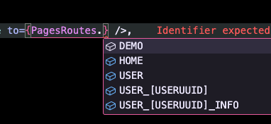

# vite-plugin-react-router-pages

基于文件的约定式路由插件。案例见 [./examples/react](./examples/react)

依赖约束

- vite
- react 18
- react router v6

文件结构

```text
src
- pages
  - home
    - index.page.tsx // 页面组件
    - layout.tsx  // 布局组件
  - user
    - [userUUID] // 动态路径
      - index.page.tsx
      - layout.tsx
- react-pages.d.ts // vite 启动生成的的类型文件
```

## Getting Started

### 1 Install

```bash
pnpm i -D vite-plugin-react-router-pages
```

### 2 Vite config

添加插件 `vite-plugin-react-router-pages` 到 `vite.config.ts`

```ts
import { defineConfig } from "vite";
import react from "@vitejs/plugin-react";
import pages from "vite-plugin-react-router-pages";

// https://vitejs.dev/config/
export default defineConfig({
  plugins: [react(), pages()],
});
```

### 3 tsconfig.json

vite 启动后会插件会生成 `react-pages.d.ts`，添加到 `tsconfig.json`，以便获得类型 typescript 支持。

```json
{
  "compilerOptions": {
    "types": ["vite/client", "./react-pages.d.ts"]
  }
}
```

### 4 Overview

导入 `import { pagesRoutes, PagesRoutes } from "virtual:react-pages";`

其中

- `pagesRoutes` 是 `RouteObject[]`, 可以直接用于 `useRoutes(pagesRoutes)`。
- `PagesRoutes` 存储路由路径，可通过 `PagesRoutes.HOME` 访问页面路径。

```tsx
import { useCallback } from "react";
import { createRoot } from "react-dom/client";
import {
  BrowserRouter as Router,
  useRoutes,
  Navigate,
  useNavigate,
  generatePath,
} from "react-router-dom";
import { pagesRoutes, PagesRoutes } from "virtual:react-pages";

const routes = [
  {
    path: "/",
    element: <Navigate to={PagesRoutes.HOME} />,
  },
  ...pagesRoutes,
];

console.log(routes);

function App() {
  const navigate = useNavigate();
  const handleClick = useCallback(() => {
    navigate(
      generatePath(PagesRoutes["USER_[USERUUID]"], { userUUID: "danzhi" })
    );
  }, [navigate]);

  return (
    <div className="app">
      <button onClick={handleClick}>navigate user/danzhi</button>
      {useRoutes(routes)}
    </div>
  );
}

const app = createRoot(document.getElementById("root")!);
app.render(
  <Router>
    <App />
  </Router>
);
```

由于 `react-pages.d.ts` 类型支持，你可以很方便的获取到页面路径。



对于动态路径，如 `/user/:userUUID`，通过 `PagesRoutes['USER_[USERUUID]']` 访问，由于路径上清晰的标记了参数 `[USERUUID]`，你可以很方便反应出参数 `userUUID`。

```tsx
import { useNavigate, generatePath } from "react-router-dom";

navigate(generatePath(PagesRoutes["USER_[USERUUID]"], { userUUID: "danzhi" }));
```

## Configuration

```ts
interface Config {
  // 默认 ['./src/pages/**/index.page.tsx', './src/pages/**/layout.tsx']
  glob?: string | string[];
  /** 生成 d.ts 的目录。 默认 ./react-pages.d.ts */
  declarePath?: string;
}
```

```ts
import { defineConfig } from "vite";
import react from "@vitejs/plugin-react";
import pages from "vite-plugin-react-router-pages";

// https://vitejs.dev/config/
export default defineConfig({
  plugins: [
    react(),
    pages({
      glob: ["./src/pages/**/index.page.tsx", "./src/pages/**/layout.tsx"],
      declarePath: "./react-pages.d.ts",
    }),
  ],
});
```

## TODO

- hot reload
- usePagesNavigate

## FAQ

### 1. 为什么不使用 vite-plugin-pages

- vite-plugin-pages 的 React 部分是 **experimental** 的，不稳定。其实现覆盖 vue React Solid，不免有些复杂，不好 fork 来改。
- 基于约定是路由能做更多事情，比如生成 `PagesRoutes`，and more。
- 研究后发现，非常容易实现，且社区没有一个相对成熟的。

## 交流


